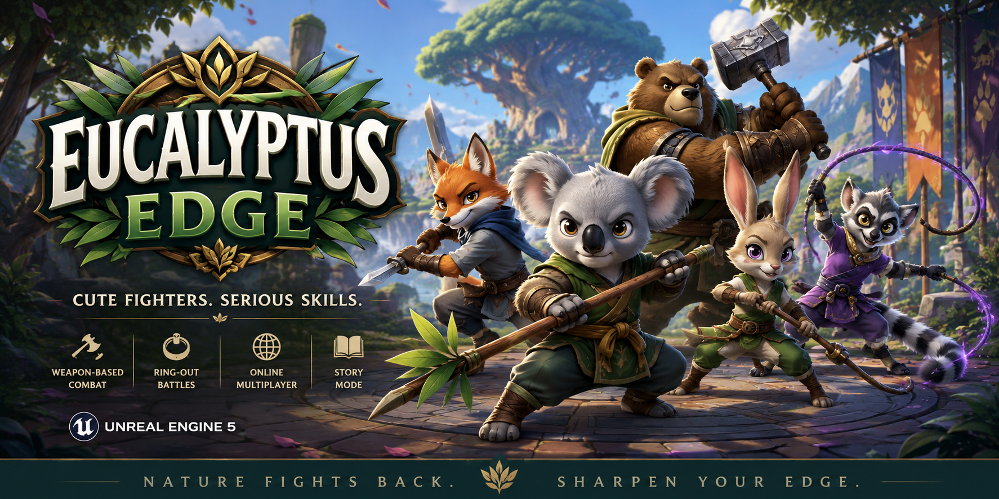

# Eucalyptus Edge

> **Cute Fighters. Serious Skills.**

Eucalyptus Edge is a family-friendly 3D weapon-based fighting game inspired by classic arena fighters. Built in Unreal Engine 5, players battle as adorable animal warriors across magical arenas using unique weapons, special abilities, and strategic combat.

---

## 🎮 About The Game

In the vibrant world of **Verdantia**, animal clans gather to compete in the legendary **Edge Festival**. When a mysterious force known as **The Blight** threatens the balance of nature, champions from every corner of the realm must fight to protect their world.

### Features

* ⚔️ Weapon-based combat
* 🦊 Unique animal fighters
* 🌎 Colorful fantasy arenas
* 💥 Special attacks and ultimate abilities
* 🛡️ Dodge, guard, and counter systems
* 🏆 Local and online multiplayer
* 🎯 Easy to learn, difficult to master
* 🎥 Replay and spectator modes

---

## 🐾 Playable Fighters for Demo

### Koda the Koala

Balanced fighter wielding the Eucalyptus Staff.

### Dash the Fox

Fast and agile technical duelist.

### Bramble the Bear

Heavy-hitting powerhouse fighter.

### Nibbles the Rabbit

Beginner-friendly speed fighter.

### Suri the Lemur

Acrobatic whip specialist.

### Plus More to Come as Game Develops and gets funded.
---

## 🗺️ Arenas

* Eucalyptus Summit
* Crystal Caverns
* Bamboo Harbor
* Frostpine Ridge
* Moonlit Rainforest

---

## 🛠️ Built With

* Unreal Engine 5.7
* Enhanced Input System
* Niagara Visual Effects
* Animation Blueprints
* Chaos Physics
* MetaSounds
* Multiplayer Networking
* Local player Combat
---

## 📅 Development Roadmap

### Phase 1 (Currently in Progress see Kickstarter page)

Combat Prototype

### Phase 2

Vertical Slice Demo

### Phase 3

Online Multiplayer Integration

### Phase 4

Full Character Roster

### Phase 5

Launch & Post-Launch Content

---

## 💰 Monetization

Eucalyptus Edge follows an ethical monetization model:

* Cosmetic Character Skins
* Seasonal Costume Packs
* Weapon Customization Packs
* Expansion Fighters
* Additional Arenas
* Soundtrack Sales
* Supporter Packs
* Merchandise Opportunities

No pay-to-win mechanics.

---

## 🤝 Contributing

This project is currently in active development and needs funding.

Feedback, suggestions, and contributions are welcome as the game evolves.

---

## 📜 License

This project is currently proprietary. All rights reserved unless otherwise specified.

---

# Nature Fights Back!

