# Eucalyptus Edge

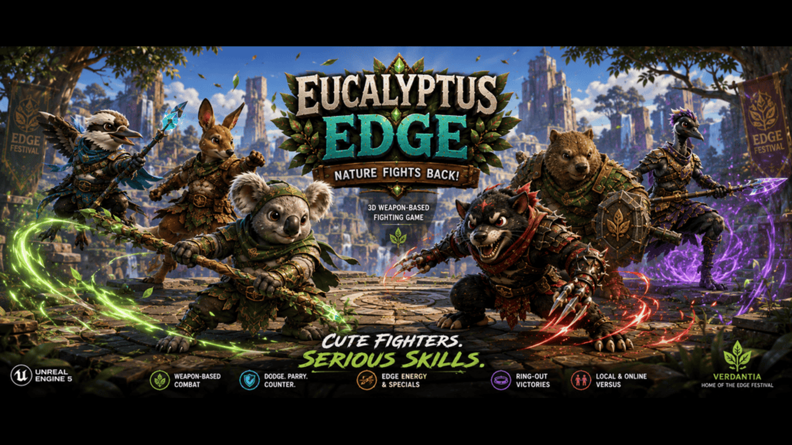

> **Cute Fighters. Serious Skills.**

Eucalyptus Edge is a family-friendly 3D weapon-based fighting game inspired by classic arena fighters such as Soulcalibur. Built in Unreal Engine 5, players battle as Australian-inspired animal warriors in the magical world of Verdantia using unique weapons, special abilities, and strategic combat.

---

## 🚀 Support Development

Eucalyptus Edge is currently seeking funding through Kickstarter.

🌿 Support the project:

https://www.kickstarter.com/projects/phoenixgoldgames/eucalyptus-edge

---

## 🎮 About The Game

In the vibrant world of **Verdantia**, animal clans gather to celebrate the legendary **Edge Festival**.

Hidden beneath the land lies an ancient force known as **The Edge**, a natural energy that empowers Verdantia's warriors with extraordinary abilities.

When a mysterious corruption known as **The Blight** begins spreading across the wilderness, champions must rise to defend their homeland and restore balance to nature.

Eucalyptus Edge combines accessible gameplay with skill-based combat that rewards timing, positioning, strategy, and mastery.

---

# 🌎 The World of Verdantia

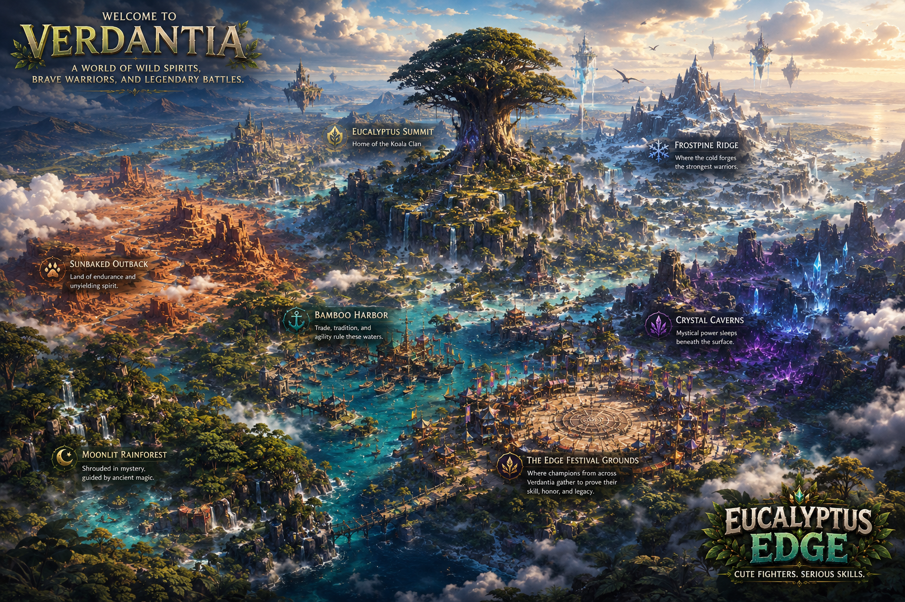

Verdantia is a magical wildlife world inspired by Australia's forests, deserts, mountains, rivers, and coastlines.

Ancient clans coexist throughout the land while gathering each year to compete in the Edge Festival.

As The Blight spreads, champions must travel across Verdantia to purify corrupted warriors and restore balance.

---

# ⚡ The Edge Energy System

The Edge is Verdantia's natural life force.

Fighters build Edge Energy by:

* Landing attacks
* Blocking attacks
* Dodging attacks
* Performing combos
* Surviving intense battles

Edge Energy powers special abilities and devastating Ultimate Attacks unique to every fighter.

---

# 🌑 The Blight

The Blight is a mysterious corruption spreading throughout Verdantia.

Blighted warriors become stronger, faster, and more dangerous than their normal counterparts.

Players must challenge and purify Blighted Champions throughout Story Mode to unlock new fighters and restore balance to the world.

---

# 🌿 Key Features

* ⚔️ Weapon-Based Combat
* 🦘 Australian-Inspired Animal Fighters
* 🌎 Stylized Fantasy Arenas
* 💥 Edge Energy Special Abilities
* 🛡️ Blocking, Dodging, and Counterattacks
* 🏆 Ring-Out Victory Mechanics
* 🎯 Easy to Learn, Difficult to Master
* 🎮 Local Versus Multiplayer
* 🌐 Online Multiplayer (Planned)
* 🎥 Replay and Spectator Systems (Planned)

---

# 🐾 Meet The Fighters

## Starting Fighters

### 🐨 Koda the Koala

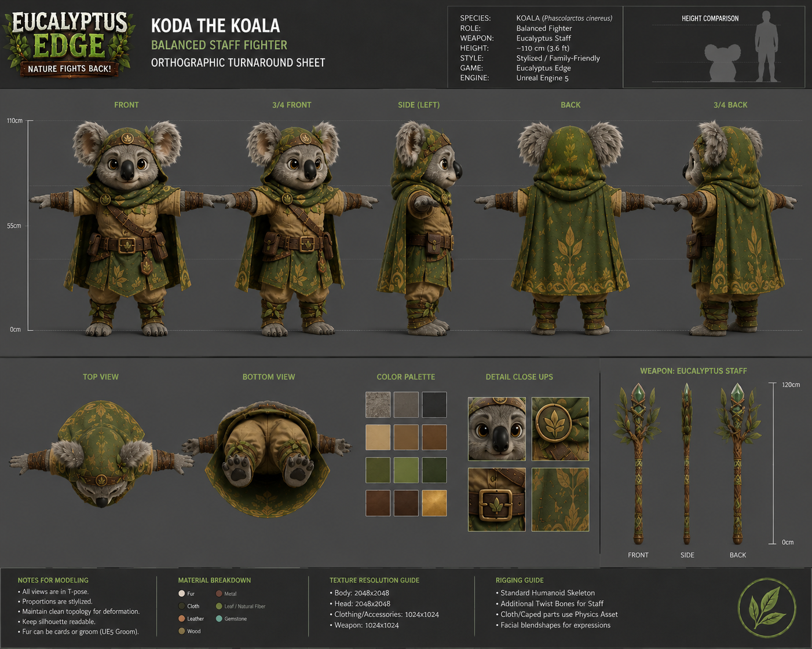

Balanced staff fighter wielding the legendary Eucalyptus Staff.

---

### 🐦 Kiri the Kookaburra

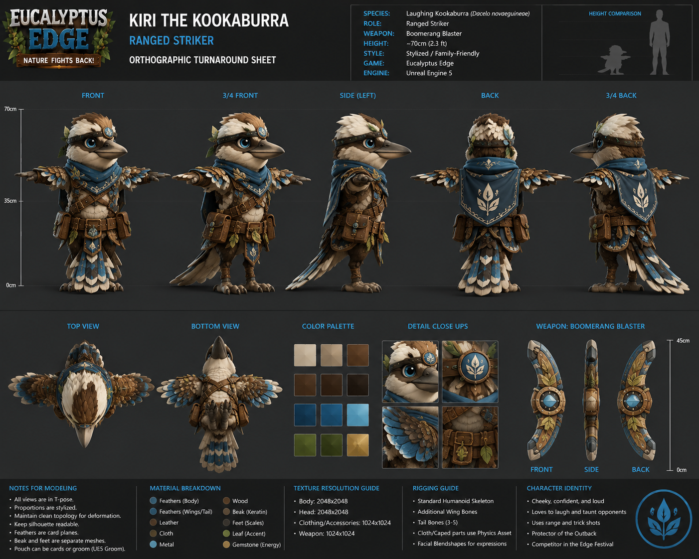

Precision duelist specializing in aerial attacks and technical combat.

---

### 🦘 Wren the Kangaroo

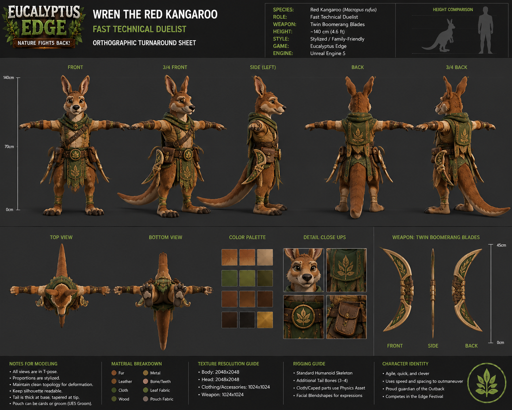

Mobile bruiser utilizing powerful kicks, mobility, and ring-out pressure.

---

### 😈 Ripper the Tasmanian Devil

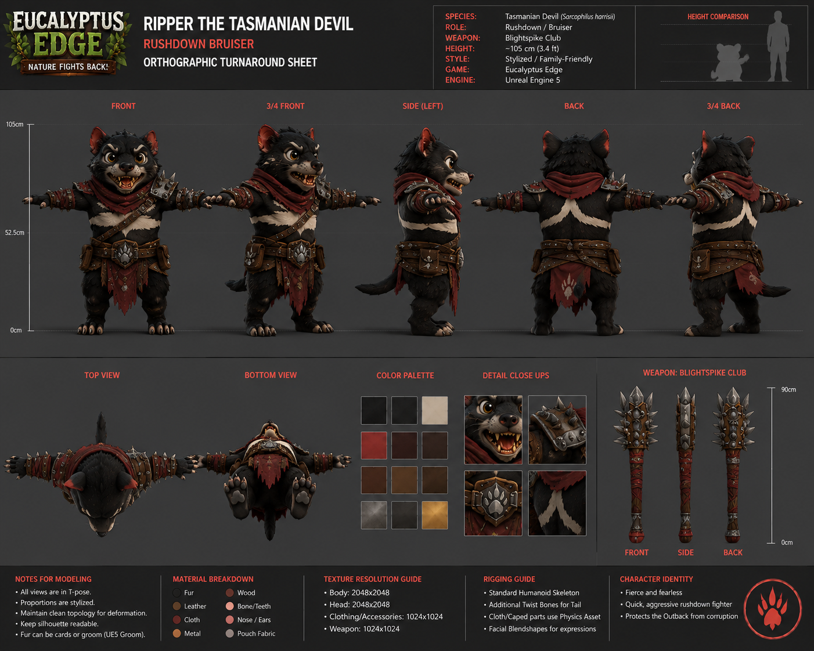

Aggressive close-range brawler focused on relentless offense.

---

## Unlockable Fighters

### 🐿️ Banjo the Sugar Glider

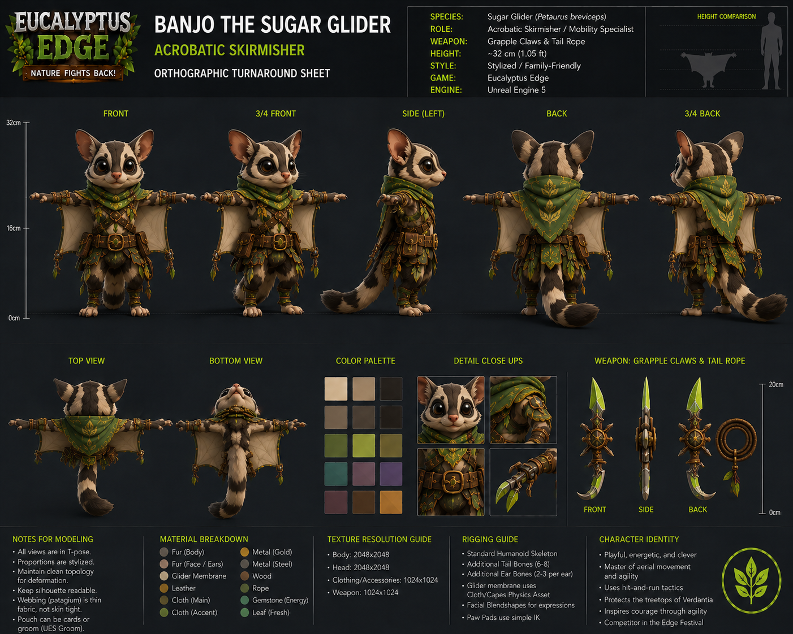

Acrobatic aerial fighter unlocked through Story Mode.

---

### 🐾 Mako the Quokka

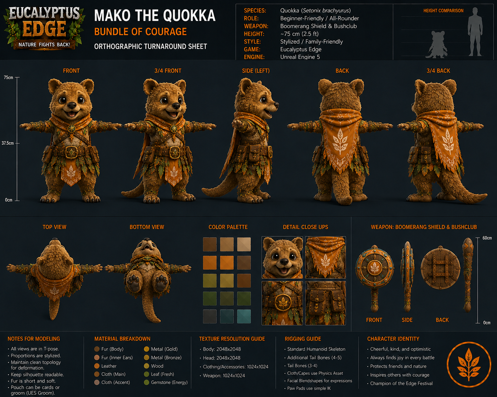

Versatile fighter unlocked by defeating Blighted Mako.

---

### 🐇 Bindi the Bilby

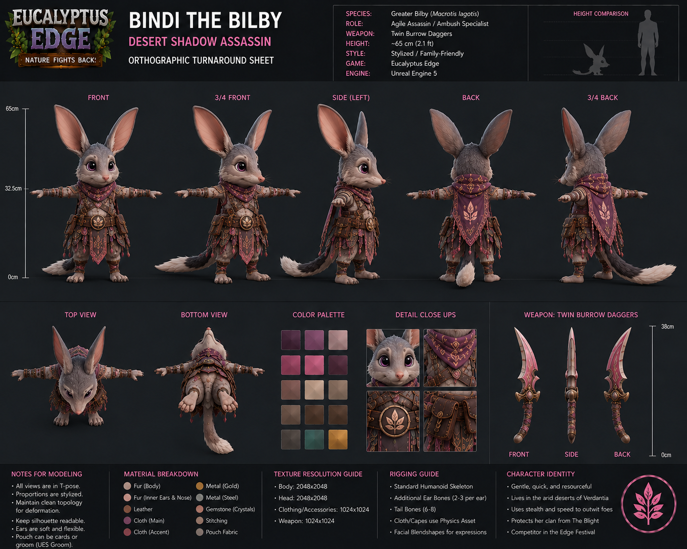

Trickster fighter utilizing agility and deceptive attacks.

---

## Future Fighters

### 🦡 Bramble the Wombat

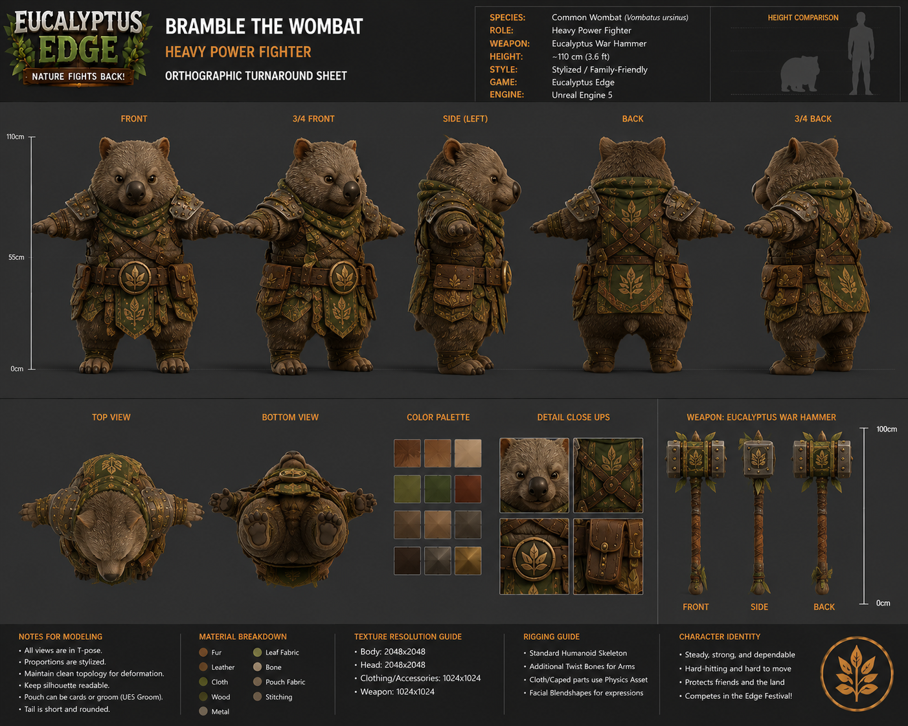

Heavy defensive fighter currently in concept development.

---

### 🦎 Tazra the Frilled Lizard

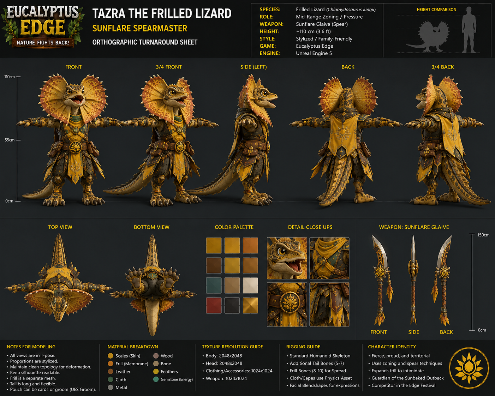

Agile fighter specializing in intimidation and mobility.

---

# 🗺️ Arenas

## Eucalyptus Summit

A sacred mountain arena surrounded by ancient eucalyptus trees, waterfalls, and dangerous cliff edges.

---

## Crystal Caverns

A glowing underground cavern filled with magical crystals and hidden dangers.

---

## Bamboo Harbor

A bustling coastal settlement planned for future development.

---

## Moonlit Rainforest

A mystical jungle illuminated by glowing flora.

---

## Edge Festival Colosseum

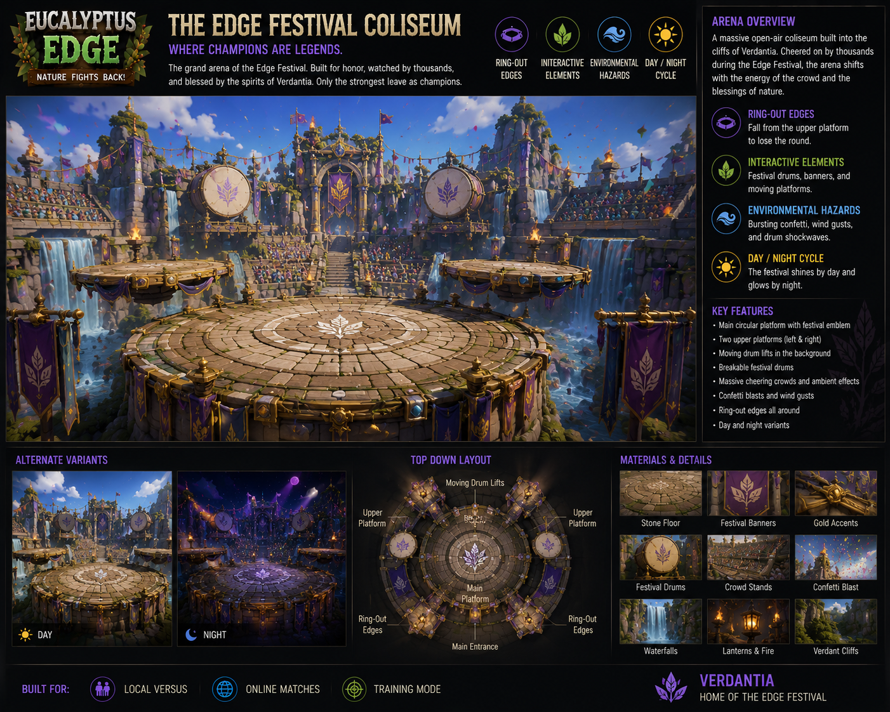

The grand tournament arena where Verdantia's greatest warriors gather.

---

## Frostpine Ridge

A frozen battlefield planned for future development.

---

# 🛠️ Built With

* Unreal Engine 5.7
* Enhanced Input System
* Niagara Visual Effects
* Animation Blueprints
* Chaos Physics
* MetaSounds
* Multiplayer Networking
* Local Multiplayer Systems

---

# 📅 Development Roadmap

## Phase 1 – Combat Prototype (Current)

* Third-Person Movement
* Camera System
* Core Combat Mechanics
* Health System
* Blocking and Dodging
* Test Arena
* Prototype Fighters

## Phase 2 – Vertical Slice

* Story Introduction
* Expanded Fighter Roster
* Edge Energy Abilities
* Arena Polish

## Phase 3 – Multiplayer Integration

* Online Matchmaking
* Private Lobbies
* Ranked Play
* Networking Improvements

## Phase 4 – Full Roster Expansion

* Additional Fighters
* Additional Arenas
* Story Expansion

## Phase 5 – Launch & Live Support

* Full Release
* Balance Updates
* DLC Fighters
* Seasonal Content

---

# 💰 Monetization

Eucalyptus Edge follows an ethical monetization model.

Planned monetization includes:

* Cosmetic Character Skins
* Seasonal Costume Packs
* Additional Fighters
* Arena Expansions
* Soundtrack DLC
* Supporter Packs

### No Pay-To-Win Mechanics

* No Loot Boxes
* No Gambling Systems
* No Gameplay Advantages Sold For Money

---

# 🤝 Contributing

Eucalyptus Edge is currently in active development.

Feedback, suggestions, bug reports, and community involvement are always welcome as the project grows.

---

# 📜 License

This project is currently proprietary.

All rights reserved unless otherwise specified.

---

# 🌿 Nature Fights Back!

**Eucalyptus Edge** is a family-friendly competitive fighting game franchise built around Australia's incredible wildlife, skill-based combat, memorable characters, and the magical world of Verdantia.

Currently in **Phase 1 – Combat Prototype**, the project is focused on building the core gameplay foundation before expanding into additional fighters, arenas, story content, and online multiplayer.

Thank you for following development and helping bring Verdantia to life.
